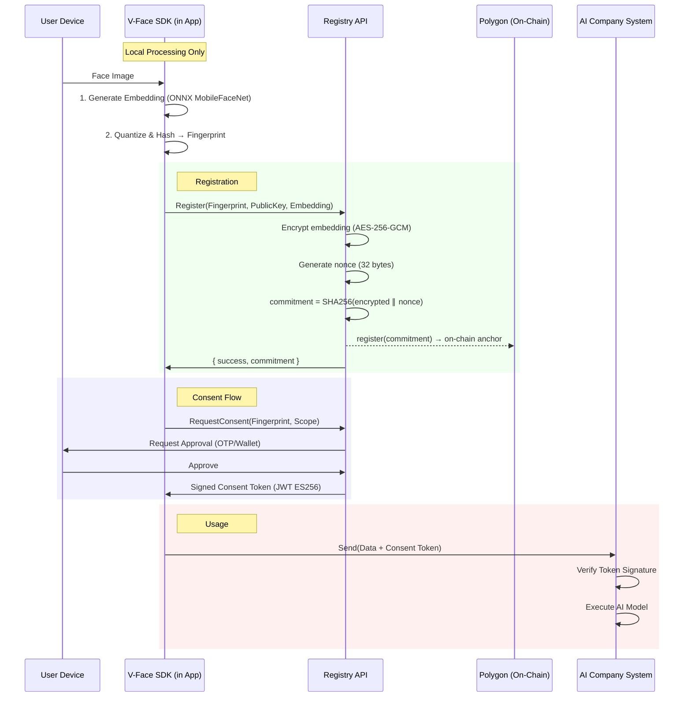

# System Architecture & Trust Boundaries

## Overview
V-Face is a privacy-preserving biometric consent protocol using a **hybrid architecture**. Client-side SDKs extract face embeddings locally, the server encrypts and stores them, and only opaque **commitments** (cryptographic hashes of encrypted data + random nonces) are anchored on-chain for tamper evidence.

No raw biometric data or biometric-derived identifiers ever touch the blockchain.

## High-Level Data Flow



## Commitment Scheme

The on-chain commitment is computed as:

```
commitment = SHA256(encrypted_embedding || random_nonce)
```

This provides three key properties:
1. **Privacy**: The commitment reveals nothing about the biometric data
2. **Unlinkability**: Same face + different nonces → different commitments  
3. **Tamper evidence**: Modifying the encrypted blob invalidates the commitment

The commitment can be verified by anyone who has the encrypted blob and nonce.

## Trust Boundaries

### 1. SDK (Client/Company Side)
**Trusted To:**
- Run the canonical MobileFaceNet model correctly
- Execute `fingerprint()` logic deterministically
- Not leak raw biometric vectors to the AI Company

**NOT Trusted To:**
- Write directly to the Registry database
- Issue consent tokens
- Access the encryption key or commitment nonces

### 2. Registry Server
**Trusted To:**
- Encrypt embeddings at rest (AES-256-GCM)
- Compute commitments for on-chain anchoring
- Authenticate users (via asymmetric key signatures)
- Sign consent tokens (JWT ES256)
- Enforce revocation (on-chain + off-chain data deletion)

**NOT Trusted To:**
- Store raw images
- Expose raw embeddings in API responses without authentication

### 3. Blockchain (Polygon)
**Trusted To:**
- Provide immutable, timestamped record of commitments
- Enforce ownership (msg.sender)
- Emit events for consent audit trail

**NOT Trusted To:**
- Store biometric data (only opaque commitments)
- Perform biometric matching

### 4. User Device
**Trusted To:**
- Generate cryptographic keys
- Approve consent requests
- Provide face images to the SDK
