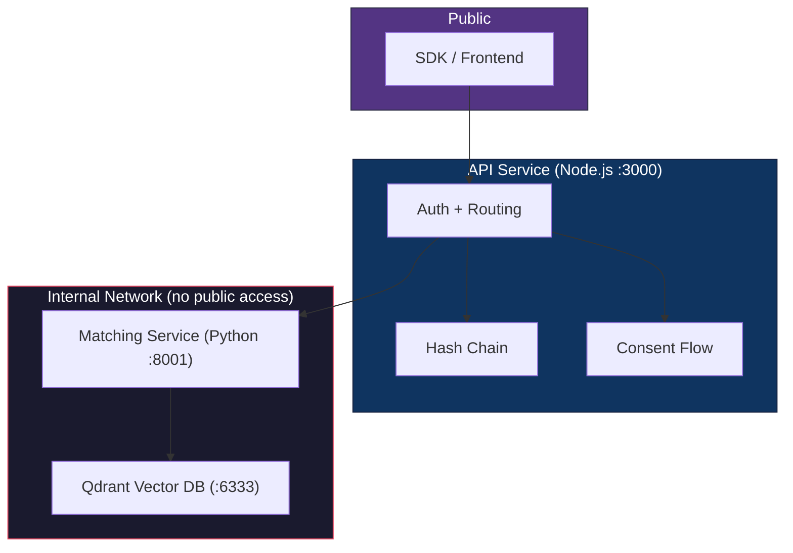

# V-Face System Architecture (v4.0 — Microservices)

## Overview

V-Face uses a **microservices architecture** for privacy-preserving biometric identity at scale (10M+ users). No blockchain, no gas, no wallets.



## Services

| Service | Tech | Responsibility | Network |
|---------|------|---------------|---------|
| **API** | Node.js / Express | Auth, routing, consent, hash chain | Public |
| **Matching** | Python / FastAPI | Decrypt embeddings, Qdrant CRUD, Sybil check | Internal only |
| **Qdrant** | Qdrant (Docker) | 128-d HNSW vector index, <10ms search | Internal only |

## Data Flow

### Enrollment
```
SDK → encrypt(embedding) → API /register
  → API computes commitment = SHA256(ciphertext ∥ nonce)
  → API forwards encrypted embedding to Matching Service
  → Matching decrypts → Sybil check → stores in Qdrant → zeroes memory
  → API appends to hash chain → signs entry
  → Returns { commitment, chainIndex, signature, vectorStored }
```

### Verification (Search)
```
SDK → encrypt(embedding) → API /search
  → API forwards to Matching Service
  → Matching decrypts → Qdrant HNSW search (top-1, threshold 0.85)
  → Returns { matched, user_id, score, search_time_ms }
  → API triggers consent flow if matched
```

## Security Boundaries

```
Public Internet
     ↓
  Node.js API (public facing, never sees raw embeddings)
     ↓ internal only (shared secret auth)
  Matching Service (decrypts in secure memory, zeroes after use)
     ↓ internal only
  Qdrant (no public access, encrypted at rest)
```

## Scale

```
10M users × 128 dimensions × 4 bytes = ~5GB raw vector data
With HNSW index overhead: ~15-20GB total
Query time: <10ms
```
