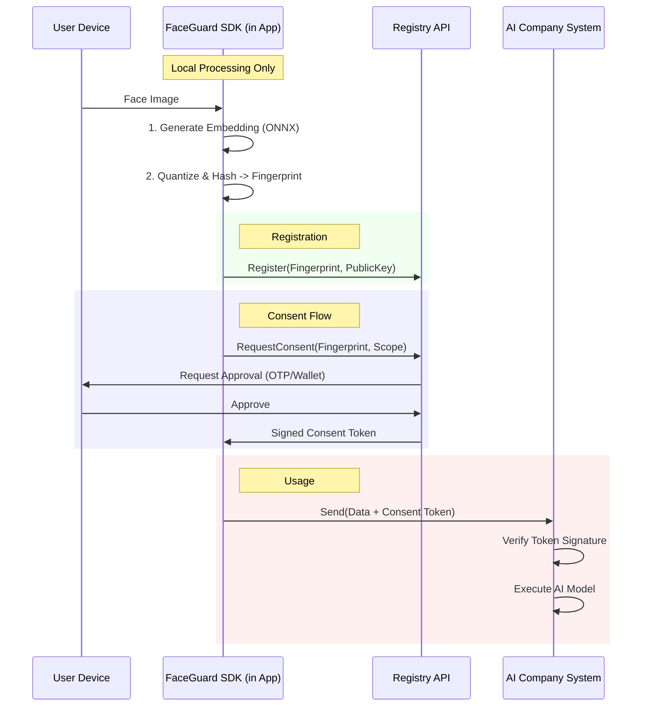

# System Architecture & Trust Boundaries

## Overview
V-Face is a consent infrastructure consisting of a client-side SDK for privacy-preserving biometric fingerprinting and a centralized (verified) Registry API for consent management.

## High-Level Data Flow

## Trust Boundaries

### 1. SDK (Client/Company Side)
**Trusted To:**
- Run the canonical embedding model correctly.
- Execute `fingerprint()` logic deterministically.
- Not leak raw biometric vectors to the AI Company (by design, though running in their environment).

**NOT Trusted To:**
- Write directly to the Registry database.
- Issue consent tokens.

### 2. Registry Server
**Trusted To:**
- Store non-reversible fingerprints securely.
- Authenticate Users (via OTP/Keys).
- Sign Consent Tokens correctly.
- Enforce revocation lists.

**NOT Trusted To:**
- Store raw images.
- Store raw embedding vectors (vectors are never sent to registry).

### 3. User Device
**Trusted To:**
- Generate keys.
- Approve consent requests.
